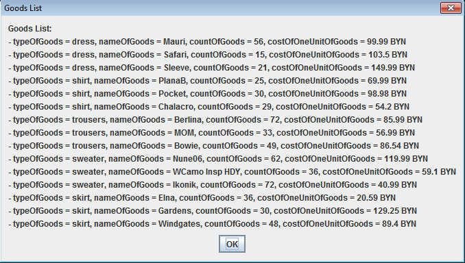
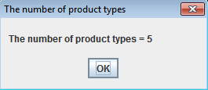
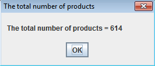

## 
## Задание:

Написать «небольшую бухгалтерскую программу», принимающую с клавиатуры информацию о товарах (тип, наименование, количество, стоимость одной единицы).
При получении некоторой команды (реализуйте на своё усмотрение) программа должна выдать следующую информацию:

 * количество типов товаров;
 * общее количество товаров;
 * средняя стоимость товара;
 * средняя стоимость товара каждого типа.

##
## Основные классы/пакеты:
 * [Main.java](src/Main.java) - происходит вход в приложение и чтение;
 * [Gui.java](src/Gui.java) - класс, содержащий все, что связанно с созданием, настройкой окна приложения, а также добавление на него кнопок и полей;
 * [goodsEntity](src/goodsEntity) - пакет, содержащий классы, создающие сущность Товара;
 * [goodsList](src/goodsList) - пакет, в котором создается список товаров;
 * [goodsAction](src/goodsAction) - пакет, содержащий классы с методами, которые реализуют основной функционал данного приложения.

##
## Скриншоты успешного выполнения:

