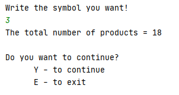
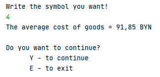

## 
## Задание:

 * 1 Скопировать решение первого модуля в новый каталоге.
 * 2 Добавить функциональность для сохранения данных в базу данных с последющим выводом на консоль, а также добавить функционал для удаления записей по ид.
 * 3 Все результаты хранить в специально созданном каталоге в репозитории и задокументировать примеры использования в README.md файле данного каталога.

##
## Основные классы/пакеты:
 * [Main.java](src/Main.java) - происходит вход в приложение и чтение;
 * [Menu.java](src/Menu.java) - класс,в котором вызаваются основные методы приложения;
 * [jdbc](src/jdbc) - пакет, в котором происходить соединение с БД;
 * [models](src/models) - пакет, содержащий модели БД;
 * [goodsActions](src/goodsActions) - пакет, содержащий классы с методами, которые реализуют основной функционал данного приложения.

##
## Скриншоты успешного выполнения:

