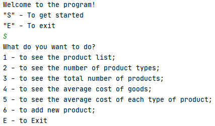

## Задание:

* 1 Модернизировать задание прошлого модуля, данные будут считываться из файла (путь к файлу вводиться с консоли)
* 2 Создать пример файла с использованием XSD

##
## Основные классы/пакеты:
 * [Main.java](src/Main.java) - происходит вход в приложение и чтение;
 * [Menu.java](src/Menu.java) - класс,в котором вызаваются основные методы приложения;
 * [models](src/models) - пакет, содержащий модели Xml-файла;
 * [parser](src/parser) - пакет, в котором происходит соединение с Xml-файлом;
 * [goodsActions](src/goodsActions) - пакет, содержащий классы с методами, которые реализуют основной функционал данного приложения.
 * [products.xml](products.xml) - список товаров в формате xml;
 * [products.xsd](products.xsd) - список товаров в формате xsd;

##
## Скриншоты успешного выполнения:

