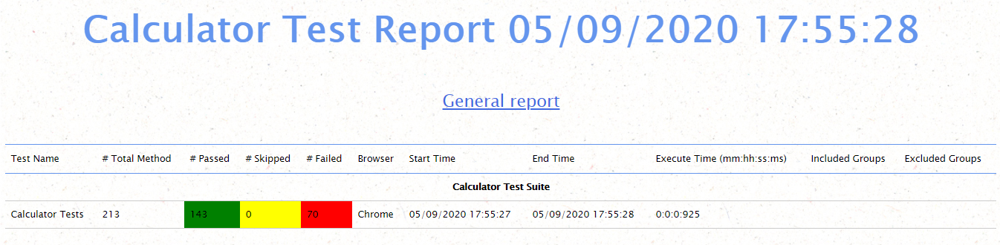
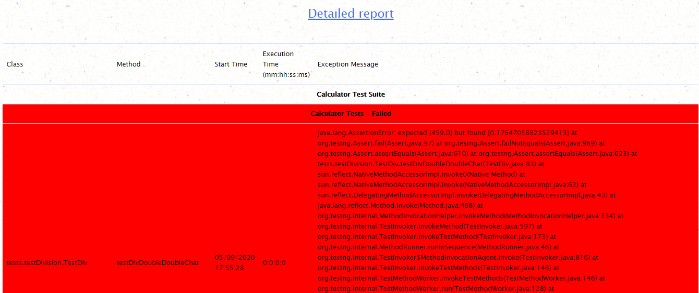
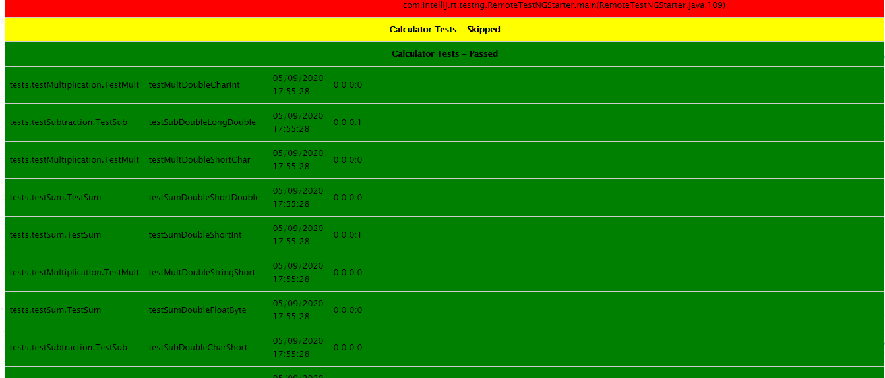

## Задание:

* 1 Добавить отчет в модуль testng с применением html+css.
* 2 Readme.md screenshot

##
## Основные классы/пакеты:

* [calculator_report.html](src/test/java/calculator_report.html) - отчет о тестах в формате html;
* [reporter](src/test/java/reporter) - пакет, в котором содержится класс, который формирует отчет, и шаблон, по которому формируется отчет;
* [runner](src/test/java/runner) - пакет, содержащий xml-файл, который запускает тесты и формирование отчета;
* [tests](src/test/java/tests) -  пакет, содержащий тесты для проверки калькулятора;
* [testData](src/test/resources/testData) - пакет, содержащий csv-файлы, в которых находятся тестовые данные.

##
## Скриншоты успешного выполнения:

